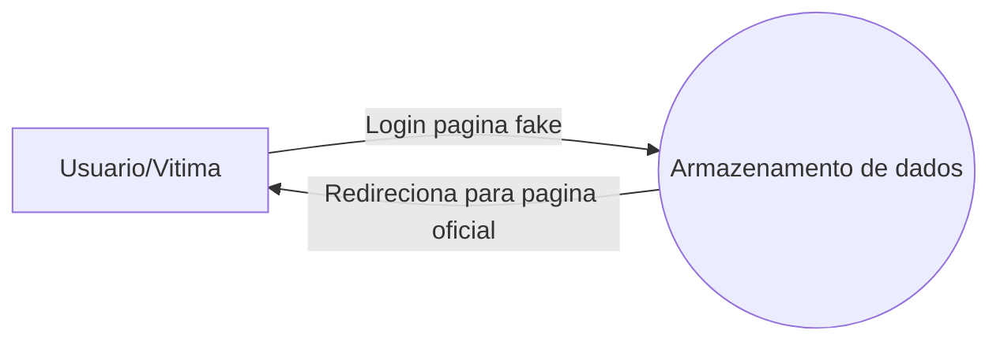
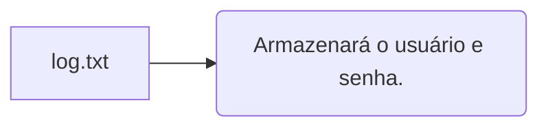

# PHISHING PAGES

**Cybersecurity**

  

A Startey tem como um dos seus propósitos colaborar com a comunidade, por promover o conhecimento e capacitá-la.

  

O arquivo disponibilizados, tem como principal objetivo o estudo da lógica e segurança da informação. Desta forma, as comunidades interessadas, ao obter maior conhecimento por meio deste, se encontrarão mais preparadas para lidar com a segurança digital.

  

A disponibilização do arquivo é de cunho educativo, sendo este exclusivamente seu intuíto. A Startey não incentiva e/ou compactua com todo e qualquer uso inapropriado do arquivo disponibilizado. O uso para fins infedividos previne pena de 3 meses a 1 ano, como descrito pelo Art. 154-A do Código Penal abaixo:

  

>Art. 154-A.
Invadir dispositivo informático alheio, conectado ou não à rede de computadores, mediante violação indevida de mecanismo de segurança e com o fim de obter, adulterar ou destruir dados ou informações sem autorização expressa ou tácita do titular do dispositivo ou instalar vulnerabilidades para obter vantagem ilícita: (Incluído pela Lei nº 12.737, de 2012).
**Pena - detenção, de 3 (três) meses a 1 (um) ano, e multa. (Incluído pela Lei nº 12.737, de 2012)**

  

  

# Lógica do sistema

  

Tendo como principal objetivo o deste repositório o estudo de páginas de phishing, a lógica atual usada em todos os arquivos disponibilizados no site são:

  

-  **Sistema**

  

Analisando a representação acima, podemos concluir a seguinte lógica: O usuário/vitima irá acessar a página fake, e inserir os dados. Após o envio dos dados via formulário os dados desta pagina serão armazenados dentro de um banco de dados e o usuário redirecionado para a pagina oficial do facebook para evitar suspeitas.

  

-  **Banco de dados**

  
  
  

# Atualizações

  

**Versão atual do projeto: 0.0.1**

  

* Página de phishing do Facebook, capturando e armazenando os dados em arquivo de texto (log.txt). (04/08/2020)

  

# Equipe responsável

  

Agradecimento da Startey a toda equipe do projeto, todos estão de parábéns pelo empenho e esforço.

  
* [CTO Startey] Gustavo de Oliveira Rosa

* [Customer Service] Alana Cristina

* [Estagiário Startey] Pedro Fortunato

* [Estagiário Startey] Bruno Ribeiro

 

## Créditos
<a  href="testRel/myLib">Créditos, para o repositório de clonagem do front-end inicialmente usado na página inicial. - User GitHub > pranavks</a>

